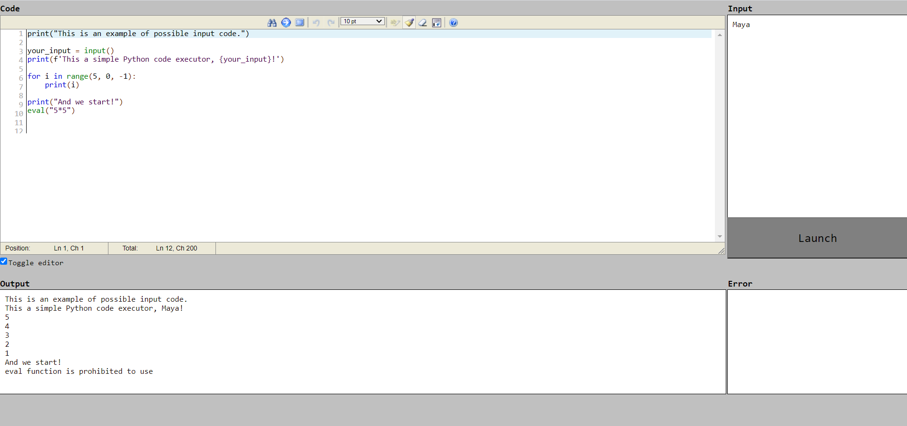

# Python code executor
## Epam final project

This is a simple web form for Python-code executing.
There are 2 input fields:
- code-field (must-have);
- stdin field (optional)

After pressing the "Launch"-button code is executed and stdout and stderr fields are filled in.
For security reasons import of os module and executing of exac and eval functions are prohibited.
Default timeout for execution is 10 seconds.

External source [edit_area](https://www.cdolivet.com/editarea/) is used for Python-code highlighting.

The program could be run:
- in a docker container;
- via cloning this repository

## To run web-application via docker:
- install [Docker](https://www.docker.com/get-started)
- download docker project:

```docker pull lantana7/python_code_executor```

- run web-application:

```docker run -d -p <your_ip>:<your_port>:8080 lantana7/python_code_executor```

## To run web-application via git:
- install [Git](https://git-scm.com/download/)
- run command:

```git clone https://github.com/Inna-Mazhorova/final_epam.git```

- install requirements.txt

```pip install -r requirements.txt```

- run web-application:
python app/main_launch.py


***Sphinx documentation*** can be seen here:
- https://final-epam.readthedocs.io/en/latest/main_launch.html#main_launch.compile

or here:
- http://localhost:8080/docs  
  
## Web-application in run:

